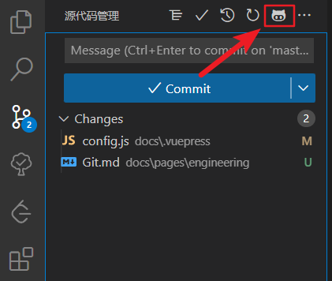
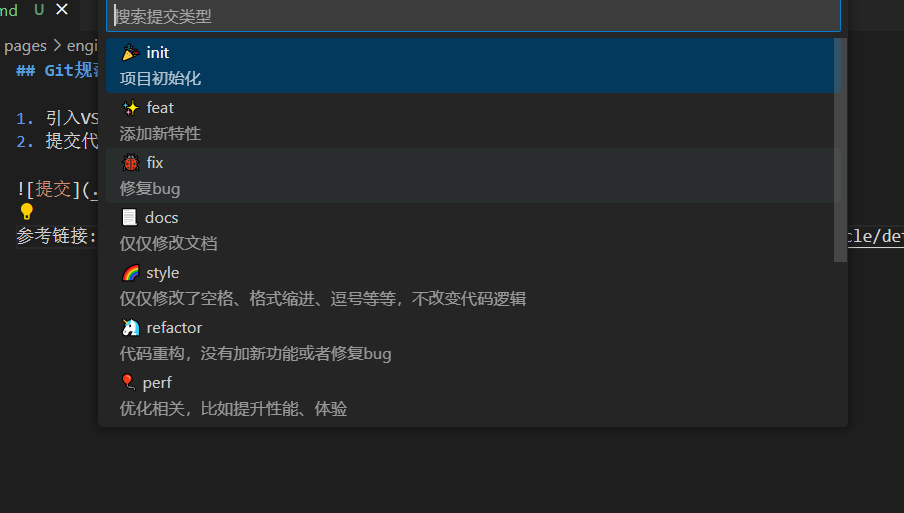
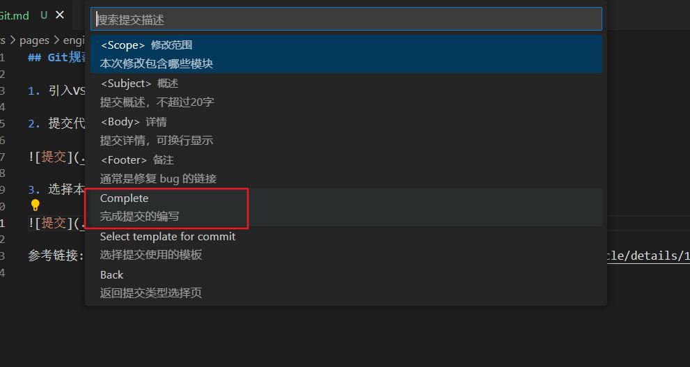
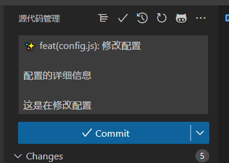
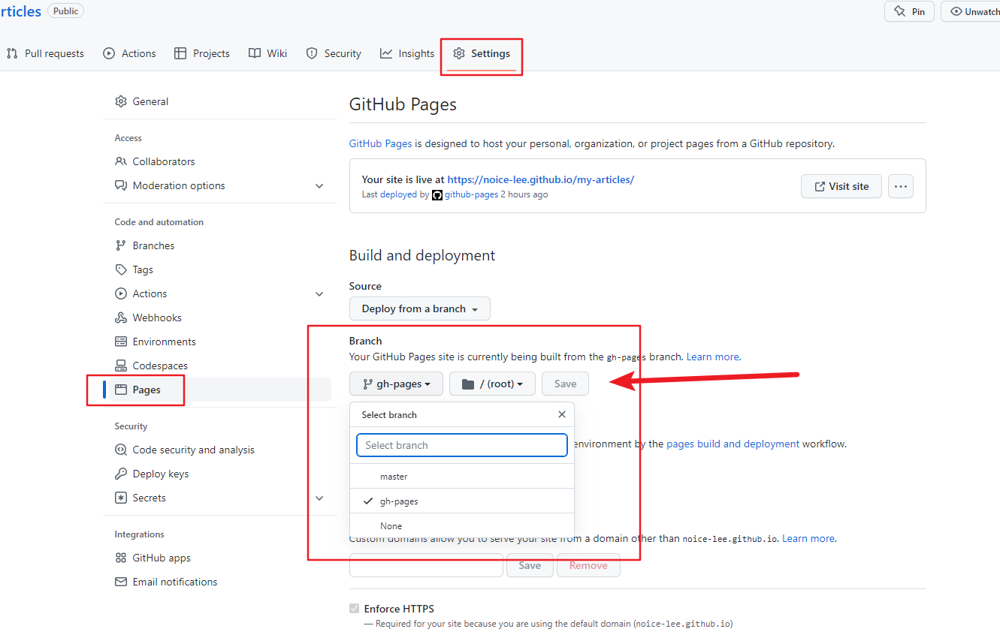

## 规范提交信息

1. 引入VSCode插件`git-commit-plugin`

2. 提交代码时点击



3. 选择本次的提交类型



4. 选择输入本次提交的范围、概述、备注后，点击完成提交



5. 自动生成的提交信息，手动点击commit提交



参考链接: [vscode插件-git-commit-plugin使用](https://blog.csdn.net/weixin_41056807/article/details/127202536)

## GitHub配置SSH

1. 命令行输入`ssh-keygen -t rsa -C 邮箱名称`

2. 进入命令行交互，第一个需要输入生成文件的地址及文件名称（会直接替换已有的文件，如果有多对公私钥可自定义名称），第二个需输入密码（可直接按空格置空），第三个确认密码

3. 生成完毕，`.pub`结尾的是公钥，无后缀的是私钥

4. 打开GitHub -> settings -> SSH and GPG keys -> New SSH key, Title自定义，将公钥复制到Key里面点击`Add SSH key`

5. 私钥文件保留在本地，若生成公私钥文件时自定义名称，需在默认目录(/c/User/username/.ssh)下创建`config`配置文件，亦可对不同远程git配置不同ssh私钥，如

``` yml
#gitee
Host gitee.com
HostName gitee.com
User  李佳宾
IdentityFile /c/Users/LiJiaBIn/.ssh/id_rsa_gitee

#github
Host github.com
HostName github.com
User 不加冰
IdentityFile /c/Users/LiJiaBIn/.ssh/id_rsa

```

6. 完成后可通过ssh协议进行推送拉取

## GitHub仓库自动同步Gitee仓库

1. 生成SSH公私钥
>可参考 [GitHub配置SSH](./Git.md#github配置ssh)

2. 在想要同步的**Github项目**中添加私钥

- 打开项目仓库 -> settings -> Security -> Actions
- 点击`New repository secret`
- 将`GITEE_RSA_PRIVATE_KEY`(可自定义，不过需和后面的变量一致)输入Name，将私钥输入到Secret中
- 点击`Add secret`

3. 给GitHub账号配置SSH公钥

- 悬浮个人头像 -> settings -> SSH and GPG keys
- 点击`New SSH key`按钮
- Title任意输入，Key为公钥
- 点击`Add SSH key`添加完成

4. 给Gitee配置SSH公钥

- 选择个人头像 -> 设置 -> SSH公钥
- 标题任意，公钥为生成的公钥，点击添加

5. 在项目根目录下创建GitHub workflow

根目录下创建`.github/workflows/SyncToGitee.yml`，其中`.github/workflows`目录为固定写法，添加代码
```yml
name: Sync To Gitee

on: [ push, delete, create ]

jobs:
  build:
    runs-on: ubuntu-latest
    steps:
      - name: Sync to Gitee
        uses: wearerequired/git-mirror-action@master
        env:
          # 注意在 GitHub项目 -> Settings->Secrets 配置 GITEE_RSA_PRIVATE_KEY 名称需一致
          SSH_PRIVATE_KEY: ${{ secrets.GITEE_RSA_PRIVATE_KEY }}
        with:
          # 注意替换为你的 GitHub 源仓库地址
          source-repo: git@github.com:noice-lee/my-articles.git
          # 注意替换为你的 Gitee 目标仓库地址
          destination-repo: git@gitee.com:noice__li/my-articles.git

```

参考链接: [使用Github Actions自动同步到Gitee仓库](https://blog.csdn.net/qq_21275565/article/details/127689691)

## GitHub Actions自动发布Pages

1. 项目根目录下创建 `.github/workflows/main.yml` 文件，yml文件可起任意名称，输入以下代码
```yml
# 来自 https://github.com/JamesIves/github-pages-deploy-action
name: Build and Deploy
on: [push]
permissions:
  contents: write
jobs:
  build-and-deploy:
    concurrency: ci-${{ github.ref }} # Recommended if you intend to make multiple deployments in quick succession.
    runs-on: ubuntu-latest
    steps:
      - name: Checkout 🛎️
        uses: actions/checkout@v3
        with:
          # 要获取的提交数，0 表示所有历史记录，默认为 1。
          fetch-depth: 0

      - name: Install and Build 🔧 # This example project is built using npm and outputs the result to the 'build' folder. Replace with the commands required to build your project, or remove this step entirely if your site is pre-built.
        run: |
          npm i
          npm run build

      - name: Deploy 🚀
        uses: JamesIves/github-pages-deploy-action@v4
        with:
          folder: docs/.vuepress/dist # 打包后的文件目录，开头不可输入/

```

2. 推送代码到github，自动触发action

3. 待自动打包完成后在github项目的`settings`中配置`Pages`，将自动生成的分支与`github pages`对应起来

